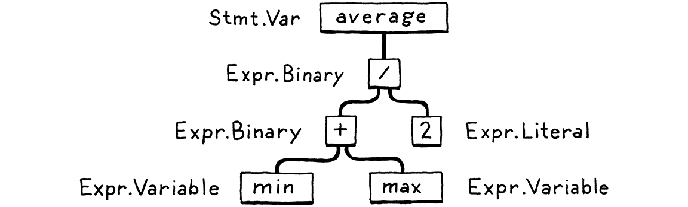
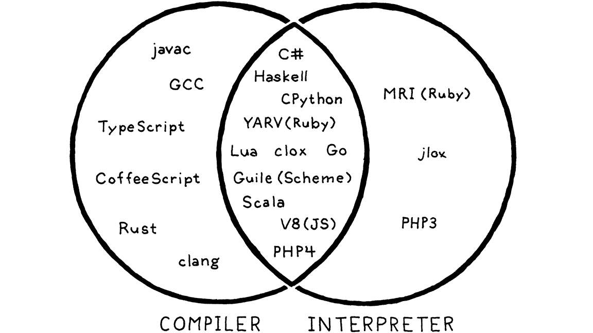

# Chapter 2.0: A Map of the Territory

[https://craftinginterpreters.com/a-map-of-the-territory.html](https://craftinginterpreters.com/a-map-of-the-territory.html)

In this book, _language_ will generally be considered shorthand for either, unless the distinction matters, in which case it will be explicit:

- Some property of the language itself, like loops or conditionals
- A language specific implementation of said constructs

> You can think of the compiler as a pipeline where each stage’s job is to organize the data representing the user’s code in a way that makes the next stage simpler to implement.

## 2.1: The Parts of a Language

An implementation starts with raw source code text. An implementation will take this and successively “climb the mountain”, analyzing the source text into some higher level representation until the implementation knows what the source code _means_. Then the implementation recursively maps this meaning into successively lower level constructs until something is generated that the CPU can directly execute!

Let’s dig further into the different “points of interest” on implementation mountain using:

 var average = ( min + max ) / 2;

as our example code.

### 2.1.1: Scanning

a.k.a. “lexical analysis” or “lexing”

This step turns the character stream into tokens that the implementation cares about. Any insignificant characters, like comments or (often) whitespace are discarded.

 var average = ( min + max ) / 2;

becomes:
 var|average|=|(|min|+|max|)|/|2|;

### 2.1.2: Parsing

The parser takes the individual tokens and turns this into a “grammar tree”, assigning some unit of meaning to individual tokens.

grammar tree == Abstract Syntax Tree (AST) == syntax tree == “trees”

**This is the step where the implementation reports syntax errors!**

### 2.1.3 Static Analysis

> Up until this point, most implementations are pretty similar across languages. Now the language specific semantics start to come into play!

Example: `a + b`. We know we’re adding `a` and `b`, but what are these? Global variables? Local variables? Where are they defined?

Now we’re doing **binding** or **resolution**. For every **identifier** in the code, we find where that name is defined and wire them together.

This is where **scope** becomes important. It’s also where we type check in statically typed languages, because we have enough info to report whether two identifiers have compatible types after wiring the identifier to its name.

All of the analysis attributes need to be stored somewhere. Commonly:

1. As attributes on the Abstract Syntax Tree from the previous step
2. In a lookup **symbol table**, keyed by identifiers

We’re approaching the, heh, **middle end** of the implementation, coined because as compilers got more complicated, there became a bunch of stuff to add between the **front end** (scanning + parsing) and the **backend** which we have yet to discover.

_We’re at the top of the implementation “mountain”!_

### 2.1.4 Intermediate Representations

Before we used the term **front end**. That’s everything specific to the source language of the program.

Now we define **back end**. This is everything specific to the target architecture the program will run on.

So…we need something in the middle. This is an “intermediate representation” that can convert many source program specific implementations into a single interface that can be then transformed to multiple target architectures.

This step makes an `m * n` problem for multi language and multi architecture compilers like GCC into an `m + n` problem!

### 2.1.5 Optimization

**If we know what a user’s program means, we can swap it’s _implementation_ out for one that is more efficient!**

A simple example: **Constant Folding**

User writes:
 const areaOfAPenny = 3.14159 *(0.75 / 2)* (0.75 / 2);

The compiler can perform this computation at compile time and reduce the expression to:
 const areaOfAPenny = 0.4417860938;

This book mostly skips over this step, as there are many popular languages that are relatively unoptimized _and_ it’s possible for a compiler developer to spend their whole career on this topic. It’s a rabbit hole!!!

### 2.1.6 Code Generation

This step converts the program into a representation that the machine can actually run. By now the word “code” refers to machine code rather than source code.

Decision time! Do we generate code for a real CPU or a virtual one? Tradeoffs:

- Real: Lightning fast but lots of work to generate. Not portable. Sooo much accumulated cruft in every real architecture.
- Virtual: Still an intermediate representation — “bytecode”. Much more portable. Easier to generate converters from byte code to each individual real architecture. Generally slower (how much?).

### 2.1.7 Virtual Machine

In the previous section, one solution for bytecode —\> real code was translation layer for each supported architecture. An alternative is writing a program that emulates a hypothetical CPU that supports your virtual architecture. We call this a virtual machine, but to disambiguate from the canonical use of the term, it’s really a “language” or “process” virtual machine. Java?

The tradeoff for this solution is that it is slower than native code because the VM has to simulate each instruction every time the program runs.

Implement your VM in a language that’s already on basically every architecture, like say **C**, and you’ve got instant portability. **This is how the second interpreter in this book is implemented!!!**

### 2.1.8 Runtime

We made it! The last step. If your language compiles directly to architecture specific machine code, you don’t have one of these. You just tell the OS to execute the program!

Otherwise the runtime is the thing that keeps track of extra information required to run the program at, you guessed it, run time.

Things like garbage collectors are implemented and run here. In a fully compiled language, the runtime is part of the executable. Otherwise the runtime is usually embedded in the virtual machine that executes the bytecode programs.

## 2.2: Shortcuts and Alternates

### 2.2.1 Single-Pass Compilers

These compilers run straight through the steps of parsing, analysis and code generation without storing intermediate representations.

> As soon as you see an expression, you must know enough to compile it

Pascal and C are examples. This is why you need forward declarations for functions in C. Back when these languages were created, memory constraints were so tight that you couldn’t hold the whole program, or even a single source file, in memory.

### 2.2.2 Tree-walk Interpreters

This strategy involves executing code as soon immediately after parsing it to an abstract syntax tree. Each node in the tree is evaluated as it is hit.

This strategy is generally pretty slow, so it’s rare for it to exist in production languages. A notable exception was the first interpreter for Ruby before it was replaced with a VM executing bytecode!

**Our first interpreter later in the book will implement a Tree-walk Interpreter!**

### 2.2.3 Transpilers

This is a big section but the gist is that you can just have your language front end output valid source code of another language. Example: Typescript.

### 2.2.4 Just-in-time Compilation

Make the interpreter or virtual machine compile the program to architecture specific machine code when it’s loaded.

Lots of production quality JIT compilers will insert profiling hooks and automatically optimize “slow” areas of execution.

JIT examples:

- JVM
- Microsoft Common Language Runtime (CLR)
- Most JavaScript interpreters

## 2.3: Compilers and Interpreters

Like plants being classified into fruits and vegetables, implementations can be classified into compilers and interpreters.

- **Compiling** is an implementation technique that involves translating a source language to some other lower level form
- **Interpreters** take source code and execute it immediately

Some implementations can be one or both!

## 2.4: Our Journey

Time to get to implementation! This overview was intended to familiarize the reader with the steps required to execute source code on a computer.

## 2.0a Download the source code

> Pick an open source implementation of a language you like. Download the source code and poke around in it. Try to find the code that implements the scanner and parser. Are they handwritten, or generated using tools like Lex and Yacc? (.l or .y files usually imply the latter.)

### Python

Here’s the parser: [https://github.com/python/cpython/blob/main/Parser/parser.c](https://github.com/python/cpython/blob/main/Parser/parser.c)

This file has 42000 lines and soooo many static defs.

This c code is unreadable to me :(

## 2.0b Why not always JIT?

> Just-in-time compilation tends to be the fastest way to implement dynamically typed languages, but not all of them use it. What reasons are there to not JIT?

Compiling to native code still provides a performance benefit. The JIT compiler has to be shipped everywhere and has startup overhead.

## 2.0c Lisp Implementations

> Most Lisp implementations that compile to C also contain an interpreter that lets them execute Lisp code on the fly as well. Why?

This allows Lisp to both be executed directly via interpreter for quick one offs but also be compiled to C for fast, cross platform native binaries.
